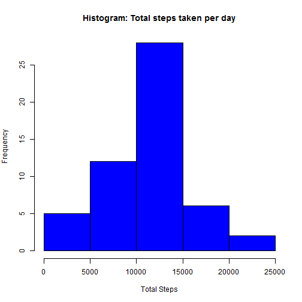
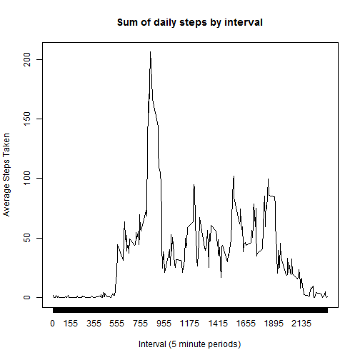
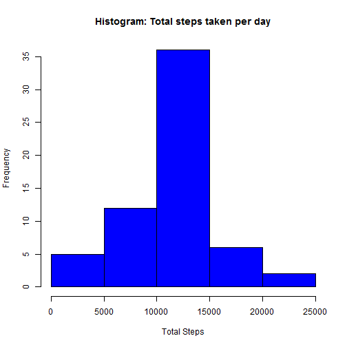
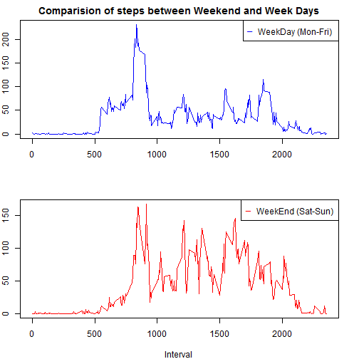

## Loading and preprocessing the data

The Code below is used to first discover if either the required 'csv' or 'zip' file exists in the working directory.
If neither exists then the source zip is Downloaded.

the next check is if the CSV does not exist but the Zip File does the Zip is extracted to a File named "activity.csv"


```r
##Set location Variables

src <- "https://d396qusza40orc.cloudfront.net/repdata%2Fdata%2Factivity.zip"
zipfl <- "activity.zip"
unzipfl <- "activity.csv"
zipdest <- paste(getwd(),zipfl,sep="/")


## Check if Files exist, Download them if not

if (file.exists(zipfl) || file.exists(unzipfl)) {
  message("Data downloaded, No need to download...")
  
} else {
  message("No Data files found... Downloading...")
  download.file(src,zipdest)
  dldate <- date()
}
```

```
## Data downloaded, No need to download...
```

```r
if (!file.exists(unzipfl)){
      message("Unzipping Download")
      unzip(zipfl)
} else {
      message("expected CSV file already available, no further action")
}
```

```
## expected CSV file already available, no further action
```

The following code reads in the "activity.csv" file to memory and converts the Date Column into a "date" data type 


```r
#Read Source Data To starter Frame
activity <- read.csv("activity.csv", header=TRUE)     

#Set Date to a 'formal' Date column
activity$date <- as.Date(activity$date, format = "%Y-%m-%d")
```

The initial Questions to be answered advise to "ignore NA Values" so a new data frame is 
created that only uses complete observations (i.e excluding any "NA" values)


```r
nona <- activity[complete.cases(activity),]
```


### Preparing the R environment
Some Functions and libraries are required in R for Processing the data so these are included here:


```r
library("ggplot2")
```

```
## Warning: package 'ggplot2' was built under R version 3.1.1
```

```r
library("plyr")
```

```
## Warning: package 'plyr' was built under R version 3.1.1
```

```r
library("data.table")
```

```
## Warning: package 'data.table' was built under R version 3.1.1
```

```r
library("reshape")
```

```
## Warning: package 'reshape' was built under R version 3.1.1
```

```
## 
## Attaching package: 'reshape'
## 
## The following objects are masked from 'package:plyr':
## 
##     rename, round_any
```

```r
library("timeDate")
```

```
## Warning: package 'timeDate' was built under R version 3.1.2
```


## What is mean total number of steps taken per day?
For this part, we will ignore the missing values in the dataset. so we can use the "nona" frame created earlier


Using the frame excluding NA values we then aggregate the data by date and number of steps into a new frame (adding the number of steps per interval) this produces the following histogram


```r
sumstepsday <- aggregate(steps~date, nona, FUN=sum)
par(mfrow = c(1,1), mar=c(5,4,4,2))
hist(sumstepsday$steps, col="blue", main="Histogram: Total steps taken per day", xlab="Total Steps")
```

 


Using the same data frame created earlier we can use the functions `mean` and `median`


```r
meansteps <- mean(sumstepsday$steps)
mediansteps <- median(sumstepsday$steps)
```

This shows us that the Mean steps from the data set are **1.0766 &times; 10<sup>4</sup>** and Median steps **10765** taken per day


## What is the average daily activity pattern?
The following Plot shows a time series, where the x-Axis shows the five minute interval and the number of steps taken accross all days


```r
dailyActivityPattern <- aggregate(steps~interval, nona, FUN=mean)
colnames(dailyActivityPattern) <- c("interval", "meansteps")
newx <- seq(from = 0, to = max(dailyActivityPattern$interval), by = 5)

with(dailyActivityPattern, plot(interval, meansteps, col="black", main = "Sum of daily steps by interval", xlab="Interval (5 minute periods)", ylab = "Average Steps Taken",type= "l",xaxt="n"))
     axis(side = 1, at = newx)
```

 


The following code identifies the 5 Minute interval, accross all days which contains the highest number of steps

```r
      max <- dailyActivityPattern[which.max(dailyActivityPattern$meansteps),]
      max <- max[,1]
```

From this we can say that period number **835** is the 5 minute period with the highest number of steps on average


## Inputing missing values

There are a number of days/intervals in the original data set where there are missing values (coded as NA). The presence of missing days may introduce bias into some calculations or summaries of the data.

The following code identifies the Number of moissing values in the data set


```r
      navalues <- sum(!complete.cases(activity))
```

This shows that there are **2304** observations with NA Values


A strategy for completing these missing values and therefore hopefully reducing bias is to use the mean for each appropriate 5 minute interval to fill in any NA value the code below create a new dataset form both the interval mean calculated eralier and the original data set, where the original 5 minute interval is code as "NA" it is replaced with the appropriate mean value for that interval


```r
      #Create Table, Joing the Mean values against the interval
      appxsteps <- join(activity, dailyActivityPattern, by = "interval")
      
      #Roll through rows, if data is NA then Pull value from the Mean column and replace the NA
      appxsteps$steps[is.na(appxsteps$steps)] <- appxsteps$meansteps[is.na(appxsteps$steps)]
      
      #Tidy Headings
      completedata <- appxsteps[,c(2,3,1,4)]
```

The following code Displays the histogram of the new data set with complete values


```r
      #Create Histogram of new dataset
      newsumstepsday <- aggregate(steps~date, completedata, FUN=sum)
      hist(newsumstepsday$steps, col="blue", main="Histogram: Total steps taken per day", xlab="Total Steps")
```

 

Using the following code we can now recalculate the Mean and the median for the new Dataset

```r
      #Mean and Median
      appxmeansteps <- mean(newsumstepsday$steps)
      appxmediansteps <- median(newsumstepsday$steps)
```

This shows us new values of mean steps of **1.0766 &times; 10<sup>4</sup>** as opposed to the original: **1.0766 &times; 10<sup>4</sup>** 
Whereas the recalculated median steps shows **1.0766 &times; 10<sup>4</sup>** as opposed to the original **10765**

This shows an increase in the median but mean stays the same. This same data may have been more greatly skewed if the NA values had been left in the original Mean and Median calculation


## Are there differences in activity patterns between weekdays and weekends?

To calculate differences in Weekends and Weekdays we need to discover what days correspond to dates and then create an exploratory chart to show the difference, the following code first assigns a value of "weekend" or "weekday" as appropriate for plotting later:


```r
completedata$state <- as.factor(isWeekend(completedata$date))
levels(completedata$state) <- c("WEEKDAY","WEEKEND")

Weekdays <- subset(completedata, state == "WEEKDAY")
Weekend <- subset(completedata, state == "WEEKEND")

Weekdays <- aggregate(steps~interval, Weekdays, FUN=mean)
Weekend <-aggregate(steps~interval, Weekend, FUN=mean)
```

The plot below shows the comparison of steps at the weekend compared to the weekday:

```r
par(mfrow = c(2,1), mar=c(4,2,2,2))
with(Weekdays, plot(interval, steps, col="blue", type="l", xlab ="", ylab="Mean Steps in interval", 
                    main = "Comparision of steps between Weekend and Week Days"))
legend("topright", pch="__", col="blue", legend= "WeekDay (Mon-Fri)")

with(Weekend, plot(interval, steps, col="red", type="l", xlab ="Interval", ylab="Mean Steps in interval", 
                   main = ""))
legend("topright", pch="__", col="red", legend= "WeekEnd (Sat-Sun)")
```

 

